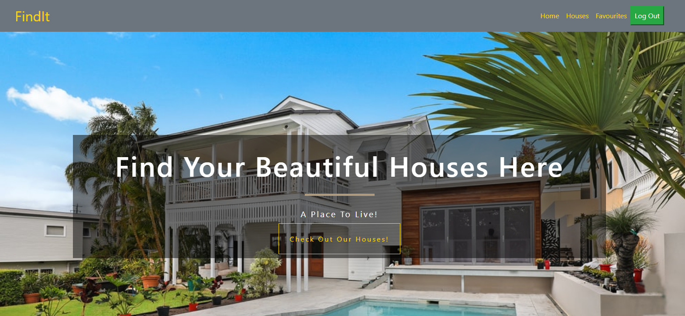
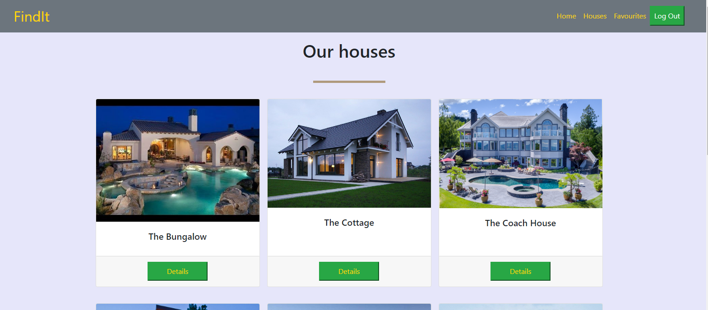

# Find Your House

An App where you can view and rent your favourite cars to a list.

# Home Page

# List of Houses

## About this project

- This Application is built as a front end app consuming a Ruby on Rails [API]() separately deployed to Heroku. Authorization was from Auth0

## End Points

POST
- /users - (create user account)
- /favourites - (create favourites)

GET
- /cars - (fetch all cars)
- /favourites - (fetch favourite cars)

## Built With
- ReactJs
- React Hooks
- Auth0
- Redux
- Netlify (For deployment)
- Jest
- CSS (Modules)
- HTML
- Webpack
- ES6 JavaScript.

## Live Demo
- For the full working application click [here]()

## Installation
- To get a local copy up and running follow these simple example steps.

### Setup
-  Clone [this](https://github.com/Arinpe/Car_Rentals-Frontend) repo

### Follow:
1. cd into the project directory
2. run npm install
3. run npm start
4. Navigate to localhost:3000

## Author

👤 **Adesuyi Adetola**

- Github: [@arinpe](https://github.com/Arinpe)
- Twitter: [_detola_](https://twitter.com/_detola_)
- Linkedin: [aadetola](https://linkedin.com/in/aadtola)

## 🤝 Contributing

- Contributions, issues and feature requests are welcome!

- Feel free to check the [issues page](https://github.com/taiwocoker/Find_a_house_app/issues)

## Show your support

- Give a ⭐️ if you like this project!

## Acknowledgments
- Microverse

- You can access all the design info (color, typography, layouts) in this [link](https://www.behance.net/gallery/37706679/Circle-(Landing-page-Dashboard-Mobile-App))

- Design idea by [Alexey savitskiy on Behance](https://www.behance.net/alexey_savitskiy)